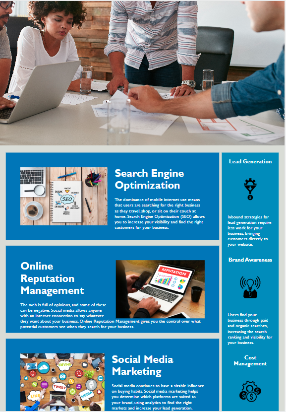

# Challenge-Week-1

## Description 

Each week the students work on a bootcamp challenge. The challenge is designed to prepare the students for various real-world scenarios and help them develop their  portfolios. This is teh first challenge done using starter code. 

## User Story
AS A marketing agency
I WANT a codebase that follows accessibility standards
SO THAT our own site is optimized for search engines

## The Tasks

1. Change non-semantic elements such as div and span to semantic ones to clearly describe each section.

2. Make sure HTML elements follow a logical structure.

3. Add 'alt' image attributes to images.

4. Arrange headings in sequential order.

5. Title elements have descriptive titles. 

6. Consolidate CSS selectors.

## Screenshot

## Installation

Application is deployed at GitHub repository. 

## Resources Used

[Semantic HTML](https://www.w3schools.com/html/html5_semantic_elements.asp)

[Image `alt` attributes](https://www.w3schools.com/tags/att_img_alt.asp)

## License 

MIT License

Copyright (c) 2022 innonka
